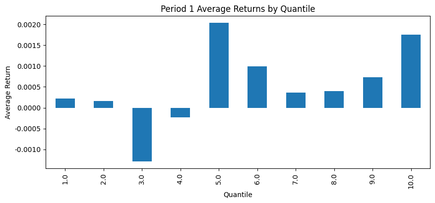
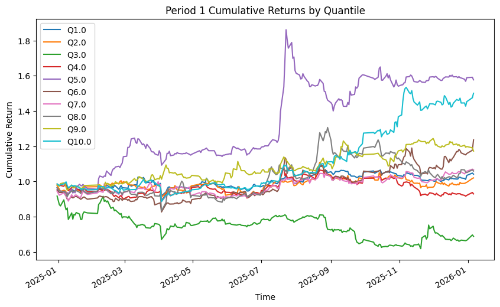

# Alpha Factor Backtest

## 1. 文档定位

本文档是 `backtest/` (回测与评估模块) 的唯一主文档，同时承担以下三种角色：

- Spec：需求规格说明
- Technical Design：技术实现设计
- Project Plan：开发排期与进度管理

本模块后续所有需求变更，必须先更新本文档中的 Spec，再同步更新 Design 和 Plan，最后才进入实现与联调。

## 2. 模块目标

本模块负责在大型语言模型（LLM）已生成的 Alpha 因子 Python 表达式的基础（即 `samples.jsonl`）上，结合真实的 A 股市场量价及基本面数据，完成严谨的量化截面回测。

该模块的目标不是重新发掘因子，而是提供一套标准、客观、自动化的打分系统：

- 动态安全地将 LLM 生成的代码转换并执行为截面因子值。
- 对计算得到的因子进行截面去极值和行业标准化等预处理。
- 根据给定的参数（如 1, 5, 22 天的持有期）计算股票的远期收益。
- 最终输出因子的表现评判指标（IC, Rank IC, IR, Rank IR, 分层收益），并生成可视化图表。

当前基线方案：
- 数据源：聚宽 JQData (包含沪深300成分股及基本面信息)
- 因子评测方法：单因子多空截面检验
- 评价维度：日度/周度/月度多周期的 IC、IR 体系验证与 Quantile 分层收益验证

## 3. 范围定义

### 3.1 In Scope

- 聚宽 JQData 真实市场数据的拉取与本地缓存机制 (`data_fetcher.py`)
- 单因子及多因子的动态安全编译执行环境 (`run_backtest.py`)
- 数据截面预处理（如去极值、标准化）与对齐 (`factor_backtest.py`)
- 核心指标（IC, Rank IC, IR, Rank IR）计算与汇总报告生成
- 因子分层收益（Quantile Returns）及多空表现可视化计算
- 提供针对所有 `samples.jsonl` 内因子的批量打分工作流

### 3.2 Out of Scope

- 大模型微调（SFT / DPO）相关工作（SFT模块）
- 因子表达式的自然语言生成机制提取（Extracter 模块）

## 4. 目录结构介绍

- **`config.py`**：全局配置文件。管理 JQData 聚宽账号信息、统一的本地数据缓存路径以及回测核心参数。
- **`data_fetcher.py`**：数据获取脚本。基于聚宽 JQData API，下载指定时间范围内沪深300成分股的量价及多维基本面数据序列化到本地。
- **`factor_backtest.py`**：核心单因子截面回测逻辑栈。实现去极值、收益分析以及各评测指标的具体计算与图表生成代码。
- **`run_backtest.py`**：因子批量/单点回测流水线。动态读入数据构造 Panel 并读取 JSONL 中的模型因子，调用因子计算逻辑并输出 CSV 报告。
- **`main.py`**：程序的统一执行入口，方便进行因子全量测试或单点 Debug 测试。

## 5. 输入与输出

### 5.1 输入

- **验证样本**：由大模型或前置模块生成的因子表达式集合，对应 `data/samples.jsonl` 文件。
- **市场底层数据**：通过 `data_fetcher.py` 脚本拉取并在本地缓存的各个维度数据（存放在 `data/` 目录下的 `.csv` 和 `.json` 文件）。
- **运行配置**：配置于 `config.py` 中的因子持有期、分层数及基准池。

### 5.2 输出

本模块（回测流水线）的常规产出均默认落盘在 `output/` 目录中：

- `output/factor_results_{timestamp}.csv`：批量打分场景下的系统总体执行结果，包含所有可测试因子的多周期（1天/5天/22天）IC、Rank IC、IR、Rank IR 指标汇总。
- `output/error_log_{timestamp}.txt`：批量执行时，语法报错或缺少数据字段因子的调试追踪日志。
- `output/{factor_id}_quantile_returns.png`：单点调试时，指定因子在截面多头与空头端的各分层平均远期收益柱状图。
- `output/{factor_id}_cumulative_returns.png`：单点调试时，指定因子多空各分段的累计净值走势折线图。

## 6. 环境配置与运行指南

### 6.1 依赖安装

请确保拥有 Python 3.8+ 环境，并安装以下主要依赖：
```bash
pip install pandas numpy scipy matplotlib jqdatasdk
```

### 6.2 聚宽数据账号配置 (JQData)

在下载行情数据之前，你需要有聚宽的账号：
在代码中已经集成如下验证：
```python
from jqdatasdk import *
auth('ID','Password') # ID是申请时所填写的手机号；Password为聚宽官网登录密码
```
请前往 `config.py` 文件，修改 `JQ_USERNAME` 和 `JQ_PASSWORD` 变量以匹配你的聚宽权限账号。

### 6.3 数据拉取准备阶段

在进行因子回测前，请拉取并构建本地环境数据：
```bash
python data_fetcher.py
```
> 下载的 csv 会留存在 `data/` 目录；跑回测前确认 `samples.jsonl` 已存在此目录下。

### 6.4 运行评估与回测

执行入口程序进行回测：
```bash
python main.py
```
可根据需要修改 `run_pipeline(target_factor_id='factor_43')` 来独立测算并画出单个因子的详情页图表。结果日志与图像将输出至 `output/` 目录。

## 7. 系统核心评估指标与图表判读

评估因子有效性时，我们主要依靠 IC、IR 和 分层回测图表，以下是具体评价标准及图例判读：

### 7.1 IC 分析 (Information Coefficient) / Rank IC 分析

- **含义**：每一期因子截面值与股票下期实际远期收益（1日、5日、22日）的相关系数。其中 IC 为皮尔逊相关系数，Rank IC 为斯皮尔曼秩相关。它代表了选股因子的预测准确度。
- **评判标准**：被视作是检验 Alpha 的基石。
  - **|IC|均值 >= 0.03 (3%)**：通常认为该因子具备有效性，有初步投资价值。
  - **|IC|均值 >= 0.05 (5%)**：说明因子拥有较强的预测能力（强 Alpha 因子）。
  - 若 IC 小于 0.02 且逼近 0，说明该因子没有显著选股预测能力。

### 7.2 IR 分析 (Information Ratio)

- **含义**：信息比率。等于一段时间内因子的 IC 均值除以 IC 序列的标准差 (IR = mean(IC) / std(IC))。反映该因子获取超额收益的稳定性。
- **评判标准**：
  - **|IR| >= 0.5**：属于可接受的稳定获利因子。
  - **|IR| >= 1.0**：可以说是极佳的优质稳定因子。

### 7.3 分层回测 (Quantile Returns) 判读

系统的绘图模块会将股票按照因子值大小分为 10 组（Q1 ~ Q10），并绘制两种核心图表：各分位平均收益图和累计收益图。

#### A. 各分层平均收益图 (Bar Chart)
该柱状图衡量各个分段在对应周期后的收益均值表现。


*(注：跑单因子测试后会自动生成至 `output/` 目录)*

**图表判读**：
优秀的因子在此图上应该展现出**严格的单调性 / 线性递增（或递减）趋势**。也就是说，如果 Q1 到 Q10 的柱体呈现非常清晰的阶梯式上升或下降，表示该因子不仅在极端层有区分度，在中间层也能很好地对收益进行排序。

#### B. 分层累计收益走势图 (Line Chart)
该折线图计算了测试阶段内各分段多空买入持有的净值演化。


*(注：跑单因子测试后会自动生成至 `output/` 目录)*

**图表判读**：
- 优秀的因子会呈现完美发散的多空序列图：所有分位数线条排列齐整，不互相交织。
- 最顶部的组别（对于正向因子是 Top quantile）净值应稳健增长，而最底部的组别的净值应随时间下降。
- 若线条互相纠缠或频繁横跳交叉，则表明因子多空表现不稳定，在震荡市或特定周期容易失效。